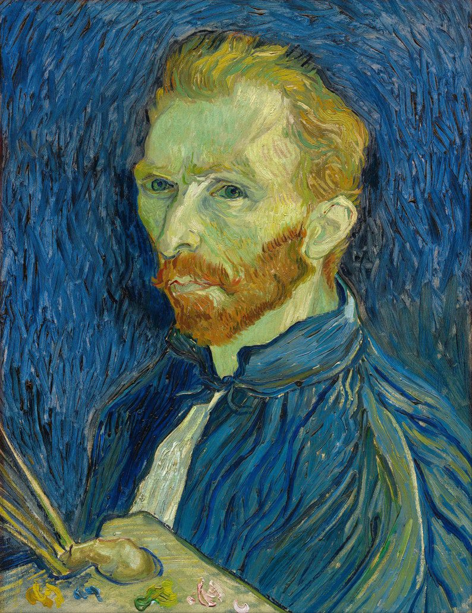

<!doctype html>
<html lang="en">

<head>
  <!-- Required meta tags -->
  <meta charset="utf-8">
  <meta name="viewport" content="width=device-width, initial-scale=1">

  <!-- Bootstrap CSS -->
  <link href="https://cdn.jsdelivr.net/npm/bootstrap@5.0.2/dist/css/bootstrap.min.css" rel="stylesheet"
    integrity="sha384-EVSTQN3/azprG1Anm3QDgpJLIm9Nao0Yz1ztcQTwFspd3yD65VohhpuuCOmLASjC" crossorigin="anonymous">

  <title>STRIKE ART</title>
</head>

<body>
  <nav class="navbar navbar-expand-lg navbar-dark bg-dark fixed-top">
    

      <a class="navbar-brand" href="#">STRIKE ART</a>
      

        <ul class="navbar-nav ms-auto mb-2 mb-lg-0">
          <li class="nav-item">
            <a class="nav-link active" aria-current="page" href="#">Home</a>
          </li>
          <li class="nav-item">
            <a class="nav-link" href="#A">About Us</a>
          </li>
          <li class="nav-item">
            <a class="nav-link" href="#C">Contact Us</a>
          </li>
          <li class="nav-item">
            <a class="nav-link" href="#B">Service</a>
          </li>
        </ul>
      

    

  </nav>
  

    

      <button type="button" data-bs-target="#carouselExampleCaptions" data-bs-slide-to="0" class="active"
        aria-current="true" aria-label="Slide 1"></button>
      <button type="button" data-bs-target="#carouselExampleCaptions" data-bs-slide-to="1"
        aria-label="Slide 2"></button>
      <button type="button" data-bs-target="#carouselExampleCaptions" data-bs-slide-to="2"
        aria-label="Slide 3"></button>
    

    

      

        
        

          <h5>MONA LISA</h5>
          
Some representative placeholder content for the first slide.

        

      

      

        
        

          <h5>THE STARRY NIGHT</h5>
          
Some representative placeholder content for the second slide.

        

      

      

        
        

          <h5>THE LAST SUPPER</h5>
          
Some representative placeholder content for the third slide.

        

      

    

    <button class="carousel-control-prev" type="button" data-bs-target="#carouselExampleCaptions" data-bs-slide="prev">
      
      Previous
    </button>
    <button class="carousel-control-next" type="button" data-bs-target="#carouselExampleCaptions" data-bs-slide="next">
      
      Next
    </button>
  

  

    <h1>ABOUT US</h1>
    

    

      

        

         Painting is an ancient medium and even with the introduction of photography, film and digital technology, it still has remained a persistent mode of expression. So many paintings have been limned over dozens of millennia that only a relatively small percentage of them could be construed as "timeless classics" that have become familiar to the public—and not coincidentally produced by some of the most famous artists of all time.

It leaves open the question of what mix of talent, genius and circumstance leads to the creation of a masterpiece. Perhaps the simplest answer is that you know one when you see one, whether it's at one of NYC's many museums (The Metropolitan Museum, the Guggenheim, MoMA and elsewhere) or at institutions in other parts of the world.

We, of course, have our opinion of what makes the grade and we present them here in our list of the best paintings of all time.
        

        

          
        

      

    

  

  

    <h1>OUR SERVICES</h1>
    

    

      

        

          

            
            

              <h5 class="card-title"></h5>
              <a href="#" class="btn btn-primary">VIEW</a>
            

          

        

        

          

            
            

              <h5 class="card-title"></h5>
              <a href="#" class="btn btn-primary">VIEW</a>
          

        

        

        

          

            
            

              <h5 class="card-title"></h5>
              <a href="#" class="btn btn-primary">VIEW</a>
            

          

    

    

    <a href="thank you.html" >VISIT US!!</a>

    

      <h1>CONTACT US</h1>
      

     

      

        

         
        

        

          <input type="name" class="form-control"id="floatingInput"  placeholder="First name" >
          <label for="floatingInput">Name</label>
          

          

          <input type="email" class="form-control" id="floatingInput" placeholder="name@example.com">
          <label for="floatingInput">Email address</label>
        

        

          <input type="password" class="form-control" id="floatingPassword" placeholder="Password">
          <label for="floatingPassword">Password</label>
        

        
         <a href="thank you.html"><button type="submit" class="btn btn-primary">Submit</button></a>
        </form>
       

  
</body>

</html>
